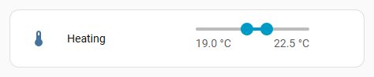
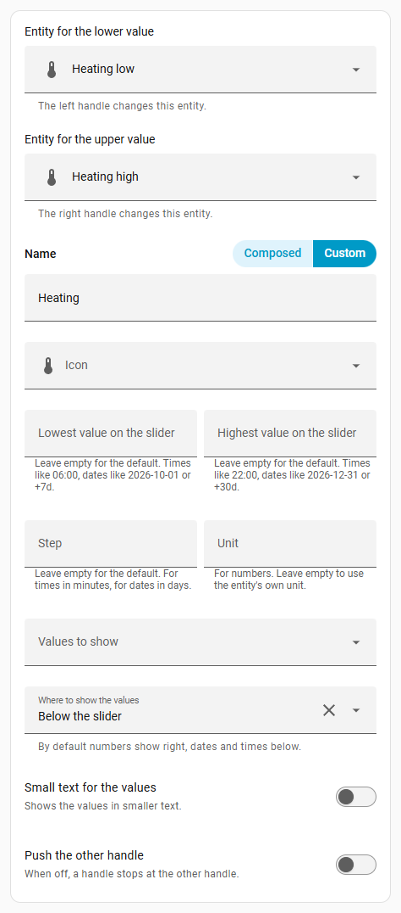
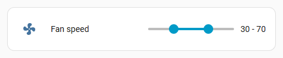
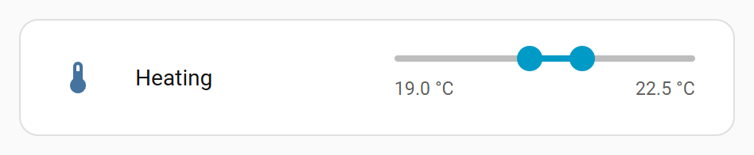
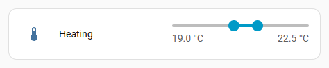
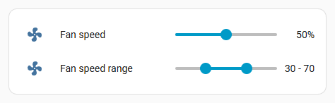
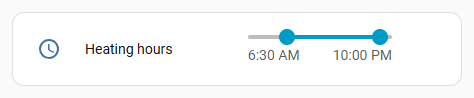
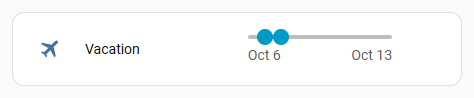
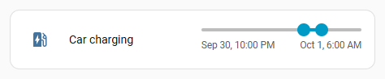

# Entity Range Slider for Home Assistant

A dashboard card with one slider and two handles. One handle sets the entity with the lower value, the other the entity with the upper value, so together they set a range: the temperature band a room should stay in, the hours the heating runs, the dates of a vacation or the window for charging the car.

It works with numbers, times, dates and dates with times. It looks and works like Home Assistant's own number slider and follows your theme. The lower value can never go above the upper value.



The card editor is available in English, Danish, German and Spanish.

## Install

Requires Home Assistant 2026.9 or newer.

### With HACS

Select this button to open the card in HACS, then select **Download**:

[](https://my.home-assistant.io/redirect/hacs_repository/?owner=mm98&repository=ha-entity-range-slider&category=plugin)

Or add it yourself:

1. Open **HACS**, select the three dots at the top right and pick **Custom repositories**.
2. Enter `https://github.com/mm98/ha-entity-range-slider`, choose the type **Dashboard** and select **Add**.
3. Search HACS for **Entity Range Slider**, open it and select **Download**.
4. Reload the page in your browser.

### Without HACS

1. Copy `dist/entity-range-slider.js` from this repository into the `www` folder of your Home Assistant configuration.
2. Go to **Settings > Dashboards**, select the three dots at the top right and pick **Resources**.
3. Select **Add resource**, enter `/local/entity-range-slider.js`, choose **JavaScript module** and select **Create**.
4. Reload the page in your browser.

## What you need

Two entities that hold the same kind of value: one for the lower value and one for the upper value.

- Numbers: [Number helpers](https://www.home-assistant.io/integrations/input_number/) (`input_number`) or `number` entities.
- Times, dates or dates with times: [Date and/or time helpers](https://www.home-assistant.io/integrations/input_datetime/) (`input_datetime`), or `time`, `date` and `datetime` entities.

The easiest is two helpers. Go to **Settings > Devices & services > Helpers**, select **Create helper** and pick **Number** or **Date and/or time**. Make one for the lower value and one for the upper value, for example "Heating low" and "Heating high", with the same settings.

## Add the card

Edit a dashboard, select **Add card** and pick **Entity range slider**. Choose the two entities and you are done.

When you pick one entity of a pair in the card picker, for example `input_number.heating_low`, and its partner exists (`input_number.heating_high`), the card is suggested with both filled in.

The card's editor has a field for every setting, so YAML is optional. Like the editors of Home Assistant's own cards, it starts with the entities, followed by sections for the content, the slider and what a tap on the icon or name does:



The same card in YAML:

```yaml
type: custom:entity-range-slider
entity_low: input_number.heating_low
entity_high: input_number.heating_high
name: Heating
position: below
```

## Examples

### Values next to the slider

The default for numbers, like Home Assistant's number slider. The values get the same space as the value of a number slider, so a longer text is cut off with "...". Use `position: below` for longer values.



```yaml
type: custom:entity-range-slider
entity_low: input_number.fan_speed_low
entity_high: input_number.fan_speed_high
name: Fan speed
```

### Values below the slider

The lower value under the start of the slider, the upper value under the end. They get more room than next to the slider. The slider keeps the size of Home Assistant's number slider.


```yaml
type: custom:entity-range-slider
entity_low: input_number.heating_low
entity_high: input_number.heating_high
name: Heating
position: below
```

### Small values

`small: true` shows the values in small text, below the slider or next to it.



```yaml
type: custom:entity-range-slider
entity_low: input_number.heating_low
entity_high: input_number.heating_high
name: Heating
position: below
small: true
```

### Full width slider

`full_width: true` lets the slider also use the space next to it, where a number slider shows its value, so the slider reaches the end of the row. Values next to the slider move below it. With `show: none` there are no values at all.



```yaml
type: custom:entity-range-slider
entity_low: input_number.heating_low
entity_high: input_number.heating_high
name: Heating
full_width: true
```

### In an entities card

As a row among other rows in Home Assistant's [entities card](https://www.home-assistant.io/dashboards/entities/). Its icon, name and slider line up with the number rows around it. Add the row in YAML once. After that, its edit button in the entities card editor opens the same editor as the card.



```yaml
type: entities
entities:
  - input_number.fan_speed
  - type: custom:entity-range-slider-row
    entity_low: input_number.fan_speed_low
    entity_high: input_number.fan_speed_high
    name: Fan speed range
```

### Times

The slider runs from 00:00 to 23:59 in steps of 15 minutes, unless you set `min`, `max` and `step`. Times are shown below the slider by default.



```yaml
type: custom:entity-range-slider
entity_low: input_datetime.heating_on
entity_high: input_datetime.heating_off
name: Heating hours
```

### Dates

The slider runs from today to 30 days from today in steps of one day, unless you set `min`, `max` and `step`.



```yaml
type: custom:entity-range-slider
entity_low: input_datetime.vacation_start
entity_high: input_datetime.vacation_end
name: Vacation
max: "+60d"
```

### Dates with times

The slider runs from today to 30 days from today in steps of one hour, unless you set `min`, `max` and `step`. A date with a time is long, so `full_width: true` and `small: true` give the values more room.



```yaml
type: custom:entity-range-slider
entity_low: input_datetime.charging_start
entity_high: input_datetime.charging_end
name: Car charging
max: "+3d"
step: 30
full_width: true
small: true
```

## Settings

| Setting | What it does |
|---|---|
| `entity_low` | The entity the handle for the lower value sets. Required. |
| `entity_high` | The entity the handle for the upper value sets. Required. |
| `name` | Name shown next to the icon. By default the words both entity names share, for example "Heating" for "Heating low" and "Heating high". |
| `icon` | Icon at the start of the row. By default the icon of `entity_low`. |
| `color` | Color of the icon, like in Home Assistant's entities card. |
| `secondary_info` | A second line under the name, for example when `entity_low` last changed, like in Home Assistant's [entities card](https://www.home-assistant.io/dashboards/entities/). |
| `min` | Lowest value on the slider. See **Limits and steps** below. |
| `max` | Highest value on the slider. See **Limits and steps** below. |
| `step` | How much a value changes per step. See **Limits and steps** below. |
| `unit` | For numbers: the unit shown after the values. By default the unit of the entities. |
| `show` | Which values to show: `both` (default), `low`, `high` or `none`. |
| `position` | Where to show the values: `inline` (next to the slider) or `below`. By default `inline` for numbers and `below` for times and dates, which are too long for the space next to the slider. With `full_width: true` the values are always below. On very narrow cards the values next to the slider are left out, like on the number slider. |
| `full_width` | `true` lets the slider also use the space next to it, so it reaches the end of the row. Values next to the slider then move below it. `false` by default: the slider has the size of Home Assistant's number slider, also when the values are below or hidden. |
| `small` | `true` shows the values in small text. `false` by default. |
| `push` | `true` lets a handle push the other one along. `false` by default. See **Handles** below. |
| `tap_action`, `hold_action`, `double_tap_action` | What a tap, a long press or a double tap on the icon or name does. By default a tap or long press opens the details of `entity_low`. See Home Assistant's [actions](https://www.home-assistant.io/dashboards/actions/). |

## Limits and steps

| Kind | `min` and `max` | `step` |
|---|---|---|
| Numbers | Numbers. By default the minimum of `entity_low` and the maximum of `entity_high`. | By default the step of `entity_low`. |
| Times | Times like `06:00`. By default `00:00` and `23:59`. | Minutes, 15 by default. |
| Dates | Dates like `2026-10-01`, or relative to today: `today`, `+7d`, `-7d`. By default `today` and `+30d`. | Days, 1 by default. |
| Dates with times | Like dates, also with a time: `2026-10-01 18:00`. By default `today` and `+30d`. | Minutes, 60 by default. |

Times and dates are shown the way Home Assistant shows them, following the language, the 12 or 24 hour clock and the time zone of your user profile. A time range stays within one day: the lower time is always before the upper time.

## Handles

By default a handle stops when it reaches the other handle, so the lower value stays at or below the upper value. With `push: true`, a handle pushes the other one along instead, and both entities change.

When both handles sit on the same spot, drag in the direction you want: towards the start of the slider moves the lower value, towards the end moves the upper value. With the keyboard, select a handle with Tab and move it with the arrow keys.

## Good to know

The card keeps the lower value at or below the upper value for changes made with the card. Changes made elsewhere, for example in an automation or in the entity's own dialog, are not checked by the card.

To build the card yourself or add a language, see [CONTRIBUTING.md](CONTRIBUTING.md).
